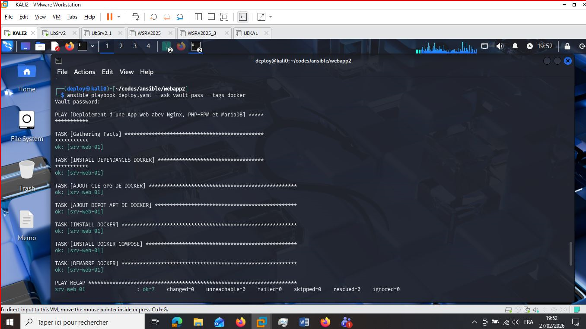
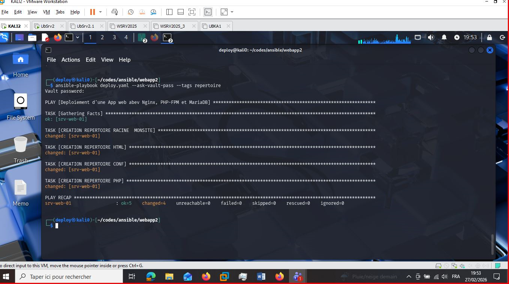
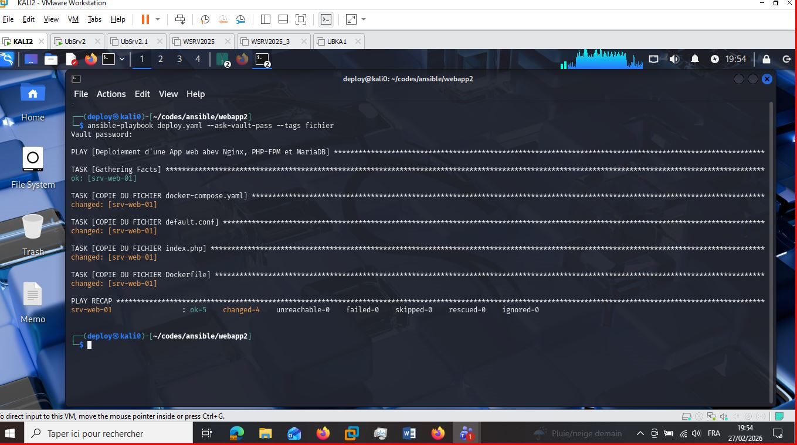
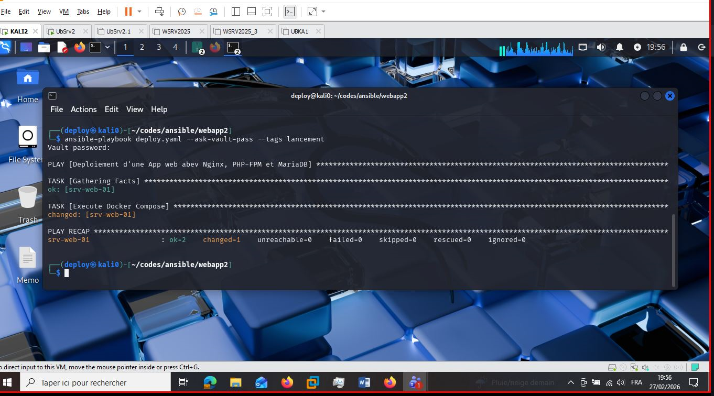
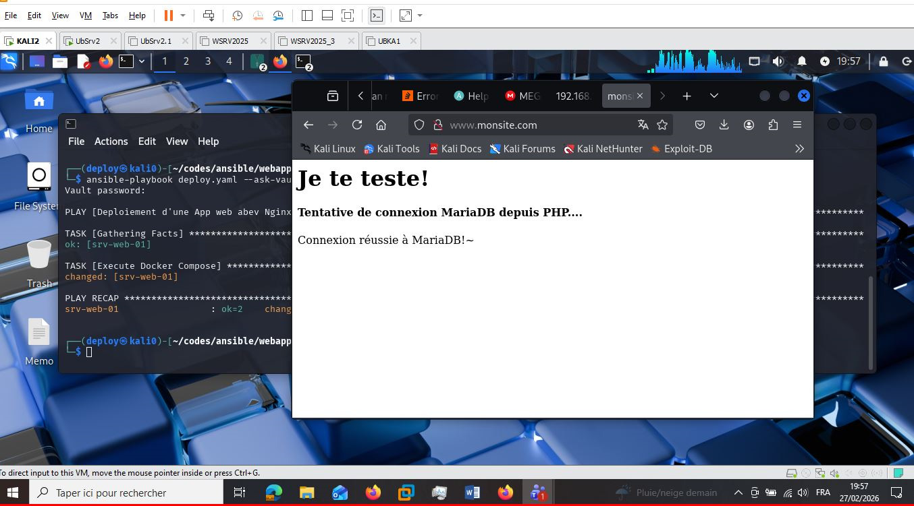
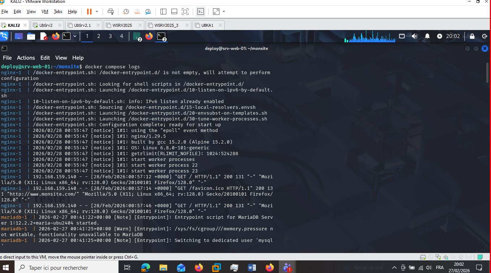
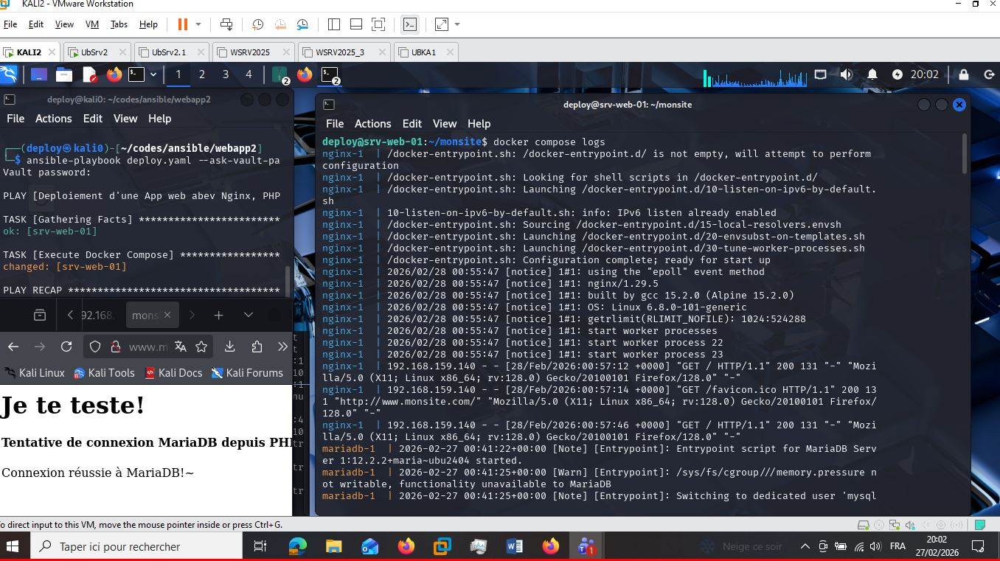

# Section Validation
## Capture pour Vérification connexion ssh

## Capture pour Installation de Docker et Docker Compose

## Capture pour Création de répertoires

## Capture pour Copie de fichiers

## Capture pour Lancement des conteneurs

## Capture pour Page Web avec connexion à la BD.

## Capture pour Journaux du serveur Web.

## Capture pour Vue d'ensemble

## Reférences

